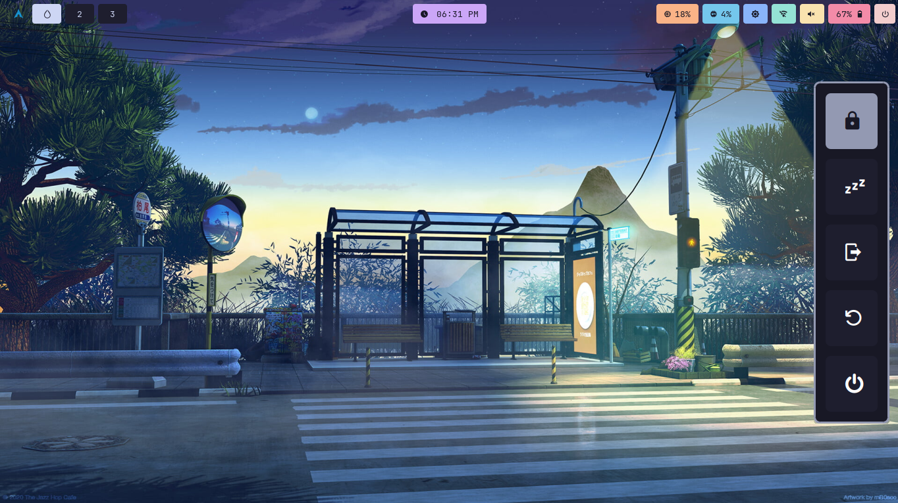

<div align="center"></div>
<h1 align="center">Hyprland Dotfiles and Configurations 🚀</h1>

<div align="center">

[](https://hyprland.org/)
[](https://github.com/Alexays/Waybar)
[](https://www.gnu.org/software/bash/manual/bash.html)
[](https://github.com/alacritty/alacritty)
[](https://github.com/lbonn/rofi)
[](https://github.com/pwmt/zathura)
[](https://github.com/dunst-project/dunst)
[](https://github.com/aristocratos/btop)
</div>

Welcome to the Hyprland Dotfiles and Configurations repository! This repository contains my personalized dotfiles and configurations for various tools, applications, and environments. Feel free to explore and use them as inspiration for your own setups. 🛠️

## Table of Contents 📋

- [Installation](#installation)
- [Usage](#usage)
- [Screenshots](#screenshots)
- [Thanks](#thanks)

## Installation 🖥️

To use these dotfiles and configurations, follow these steps:

1. Clone this repository to your local machine:

   ```bash
   git clone https://github.com/R0h1th-1DD4E2/Hyprland-Dots.git
   ```

2. Navigate to the cloned directory:

   ```bash
   cd Hyprland-Dots
   ```

3. Review the dots and configurations to understand their purposes and customize them according to your preferences. Ue them according to your needs

## Usage 🚀

This repository includes configurations for Hyprland and other tools, including:

- **Shell**: Custom Aliases, functions and other for Bash.
- **Window Managers**: Settings for window managers Hyprland.
- **Terminal Emulators**: Preferences for terminal emulators like Alacritty, and Kitty Terminal.
- **Other Tools**: Additional configurations for Btop, Dunst, and more.

## Screenshots 📸

Here are a few other screenshots showcasing my customized setups:


<div align="center"> Terminal - Alacritty </div>


<div align="center">Btop</div>


<div align="center">Rofi</div>


<div align="center">Exit Menu using Rofi</div>

## Thanks 🙏

- [Sameemul Haque](https://github.com/sameemul-haque/) - Thanks for sharing your dotfiles and configurations.
